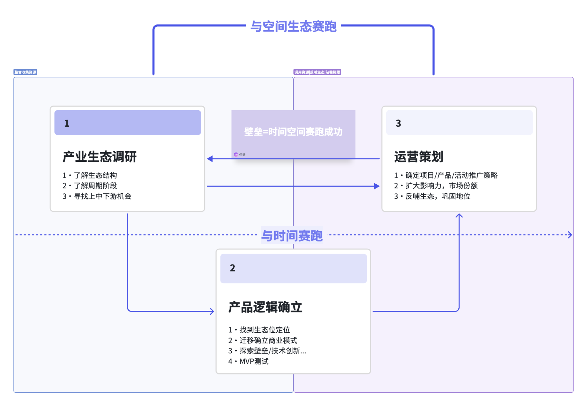

## 操盘通病

初创项目操盘中常见的致命问题：

- **盲目乐观**：高估市场需求，低估竞争烈度，对项目前景缺乏理性判断
- **贪多求全**：什么都想做，资源分散，没有聚焦核心能力
- **忽视节奏**：不理解项目发展有阶段性，在错误的阶段做错误的事
- **团队失衡**：创始团队能力单一，或者关键岗位长期空缺
- **现金流失控**：烧钱速度远超预期，没有建立合理的财务模型
- **执行力缺失**：战略方向正确但落地能力差，想得到做不到
- **缺乏复盘**：重复犯同样的错误，不从失败中提取经验

---

## 操盘三步法

### 第一步：产业生态调研

- 了解生态结构
- 了解周期阶段
- 寻找上中下游机会

### 第二步：产品逻辑确立

- 找到生态位定位
- 迁移确立商业模式
- 探索壁垒/技术创新...
- MVP测试

### 第三步：运营策划

- 确定项目/产品/活动推广策略
- 扩大影响力，市场份额
- 反哺生态，巩固地位

> 壁垒=时间空间赛跑成功。整合收集资源，调用资源反哺生态站稳脚跟。与空间生态赛跑，与时间赛跑。

---

## 七段周期论

每个项目都会经历不同的发展阶段，理解周期规律是穿越周期的前提。

### 起步期

- **核心任务**：验证需求，跑通最小可行产品（MVP）
- **关键指标**：用户是否愿意使用、是否愿意付费、是否愿意推荐
- **常见陷阱**：过度打磨产品而忽视市场验证，在没有验证需求的情况下大规模投入
- **策略**：快速试错，低成本验证，保持灵活

### 成长期

- **核心任务**：规模化增长，建立竞争壁垒
- **关键指标**：增长速度、获客成本、留存率、单位经济模型
- **常见陷阱**：增长掩盖了底层问题，组织能力跟不上业务增长
- **策略**：在增长中建设能力，同时投入增长和基础设施

### 整合期

- **核心任务**：消化前期增长成果，优化运营效率
- **关键指标**：利润率、运营效率、客户满意度
- **常见陷阱**：惯性思维，继续追求增长而忽视效率
- **策略**：精细化运营，提升人效，巩固核心优势

### 涅槃期

- **核心任务**：面对瓶颈或危机，寻找第二曲线
- **关键指标**：新业务探索的进展、组织变革的执行力
- **常见陷阱**：守旧不变或盲目转型
- **策略**：在保持基本盘的同时探索新方向，允许内部创新试错

### 收获期

- **核心任务**：收割前期投入的回报，实现盈利最大化
- **关键指标**：利润规模、市场份额、品牌溢价
- **常见陷阱**：过度收割导致产品和服务质量下降
- **策略**：平衡短期收益和长期价值，持续投入维护核心竞争力

### 变革期

- **核心任务**：主动或被动地进行根本性变革
- **关键指标**：变革推进速度、组织适应性、新能力建设进度
- **常见陷阱**：变革半途而废，或者为变革而变革
- **策略**：坚定变革决心，但要分步推进，管理变革风险

> 周期不是线性的，可能跳跃或回退。关键是在每个阶段做对的事，并提前为下一阶段做准备。

---

## 产品升级与降级

### 人均GDP法

- 通过分析目标市场的**人均GDP水平**判断产品定位
- 人均GDP决定了消费能力和消费意愿的天花板
- 不同GDP区间的市场，用户对价格和品质的敏感度不同
- **高GDP市场**：用户愿意为品质和体验付费，适合做升级
- **低GDP市场**：用户对价格敏感，适合做性价比产品

### 团队核心能力法

- 产品升级还是降级，取决于团队核心能力的匹配度
- **技术驱动型团队**：适合做产品升级，通过技术创新提升产品力
- **运营驱动型团队**：适合做降级市场的规模化覆盖
- **资源驱动型团队**：适合做整合型产品，利用资源优势建立壁垒
- 选择与团队能力匹配的方向，避免用短板去竞争

### 降级逻辑

- **降低成本结构**：砍掉非核心功能，简化产品形态
- **扩大覆盖范围**：用更低的价格触达更广的用户群
- **标准化交付**：减少个性化，提高交付效率
- **渠道下沉**：进入下沉市场，寻找增量空间
- 降级不是降低品质，而是**在更低的价格带上提供足够好的解决方案**

### 升级逻辑

- **提升产品力**：增加高价值功能，提升用户体验
- **品牌溢价**：通过品牌建设获取定价权
- **深度服务**：从产品交付转向解决方案交付
- **细分市场**：针对高净值用户群提供专属产品
- 升级的前提是**目标市场有足够的付费意愿和能力**

---

## 运营策划推广

### 虚拟/服务业

- **内容营销**：通过高质量内容建立专业度和信任感
- **社群运营**：建立用户社群，形成网络效应和口碑传播
- **KOL合作**：借助意见领袖的影响力快速触达目标用户
- **裂变增长**：设计分享机制，利用存量用户带来增量用户
- **私域流量**：构建自有用户池，降低获客成本，提高复购率
- **数据驱动**：通过数据分析优化运营策略，提升转化效率

### 实体产业

- **渠道建设**：建立稳定的分销网络，确保产品触达终端
- **线下体验**：通过线下场景让用户直观感受产品价值
- **供应链优化**：降低生产和物流成本，提高交付效率
- **区域深耕**：先在局部市场建立优势，再逐步扩张
- **异业合作**：与互补型企业合作，共享客户资源
- **品牌活动**：通过线下活动和事件营销提升品牌知名度

---

## 商业模式范式

### 产业边界三项限（构建供给侧）

产业边界的三维象限：

- **同业维度**：产业链同业合作，联合同业降本增效
- **异业维度**：产业链异业合作，团队互补、资源互补
- **行业维度**：产业链上下游横向合作，产业链上下游整合做大

> 三项限从同业、异业、行业三个维度定义了产业的**供给侧结构**。理解产业边界的三维象限，才能找到合作与竞争的最优策略。

### 企业战略客户六度模型（构建需求侧）

ABCGPS模型——从六个维度理解和服务客户：

1. **To Agent**：社交/社群/多层分销
2. **To Business**：民企/国企；大企/小企
3. **To Customer**：幼青中老；贫/中/富
4. **To Government**：政府/中央/地方政府
5. **To Partner**：同行/上下游/跨界/人才
6. **To Shareholder**：战略型/财务型/业务型

> 企业战略客户的六度模型（ABCGPS模型）定义了**需求侧结构**。每一类客户需要不同的触达方式和价值主张。

---

## 重看0-1，探索1-10

### 0到1：从无到有

- **核心命题**：找到Product-Market Fit（产品市场匹配）
- 0到1阶段的关键是**验证**，不是**规模化**
- 需要回答的根本问题：这个问题是否真实存在？我的解决方案是否有效？用户是否愿意为之付费？
- 0到1的方法论：精益创业、快速迭代、用户访谈、最小可行产品
- **常见错误**：把0到1当作1到10来做，过早投入大量资源进行规模化

### 1到10：从有到优

- **核心命题**：在已验证的基础上实现规模化增长
- 1到10阶段的关键是**复制和放大**已验证的成功模式
- 需要解决的问题：增长引擎是什么？组织能力能否支撑增长？单位经济模型是否健康？
- 1到10的方法论：增长黑客、组织建设、流程标准化、融资与资源整合
- **常见错误**：在没有完成0到1验证的情况下强行推进1到10，或者1到10阶段仍然用0到1的方式运作

### 关键转变

从0到1进入1到10，团队和创始人需要完成几个关键转变：

- **从探索到执行**：减少试错，聚焦已验证的方向
- **从个人到组织**：从依赖创始人个人能力到建设组织能力
- **从灵活到规范**：建立必要的流程和制度，但避免过度官僚化
- **从产品到商业**：从关注产品本身到关注完整的商业模式
- **从生存到发展**：从活下来到活得好，追求更高的目标

> 0到1和1到10是两种完全不同的游戏，需要不同的能力和思维方式。很多项目失败在于：用错误阶段的方法论去应对当前阶段的挑战。
